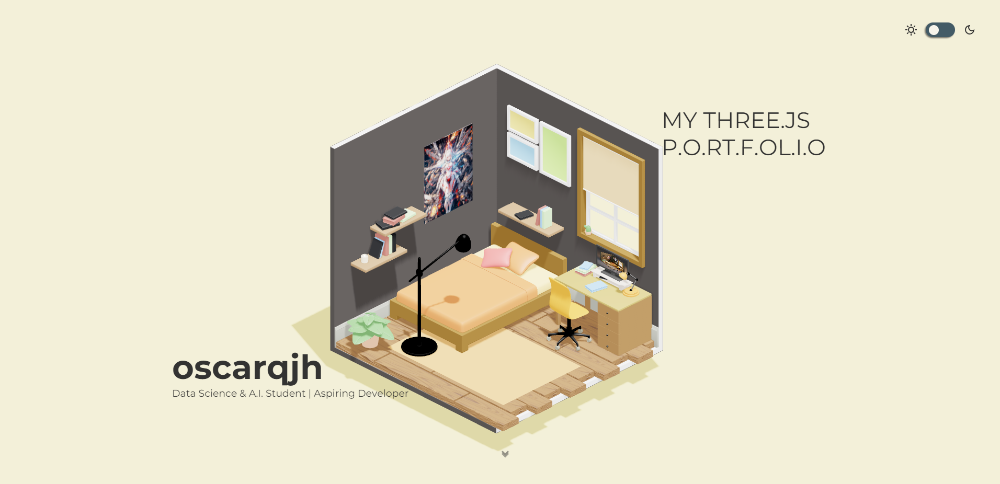

# Threejs Portfolio Website




---

### Section 1: Introduction

This project draws significant inspiration from **bokoko33**'s website. Working on this endeavor allowed me to explore various facets of Three.js and Blender, becoming more proficient in both. The outcome achieved closely resembles the original website, with some touch of my own.

This project is live [here](https://oscar-threejs.vercel.app/)

Check out Bokoko33's original website [here](https://bokoko33.me/)

---

### Section 2: Local Deployment

If you wish to deploy this project locally, first clone this repository into your local directory, then install the dependencies

```
npm i
```

Next, deploy it locally

```
npm run dev
```

---

### Section 3: Features and Design Consideration

#### 3.1 THREE.js and Blender

Blender has always fascinated me with its capability in 3D modelling, animation and material design. With the discovery of Three.js, I was excited to try out the numerous possibility to deploy my models live of a website. Through this project, I was able to familiarise myself with the general workflow of working with blender to Three.js, this includes exporting the model to `.glb` format and baking of material textures onto UV map.

#### 3.2 Singleton Design Pattern

In this project, I've used the Singleton design pattern to factorise my project. Thisis a creational design pattern that ensures that a class has only one instance while providing a global access point to this instance. This means that a single class is responsible for creation of objects and at this same time acts as an access point to other classes.

#### 3.3 GSAP timelines and scrollTrigger

Most animations in this project is accomplished with the help of the GSAP library. It allows for easy sequencing of animation without compromising on controls.

#### 3.4 GLSL Shader


I got to learn the basics of the GLSL language to generate amazing textures as part of this project. This allows me to generate patterns and animations that are both intricate and beautiful. The patterns in the frames are generated via this method in this project.

#### 3.5 CSS Animation

Through this project, I have also gotten my first experiencing in animating simple pure CSS animation using `@keyframes`. This is a really quick and easy way to make short animations without the need to external softwares or libraries.

---

### Section 4: Post-Project Thoughts

#### 4.1 Learned

Through this project, I had the opportunity to enhance and refine my skills in CSS and JavaScript. Specifically, I focused on utilizing global variables in CSS to streamline my code and explored the creation of basic CSS animations using keyframes. Moreover, I delved into the realm of object-oriented JavaScript, employing the simpleton design principle for better organization and efficiency.

What made this project truly exciting was the introduction to new concepts such as Three.js and GLSL. Three.js proved to be an exceptional framework for visualizing 3D assets, including those I crafted using Blender. Additionally, I dabbled in GLSL programming, enabling me to create captivating and distinctive animations that could be projected onto the objects within the scene.

#### 4.2 Next Step...

Looking ahead, I am eager to further immerse myself in these technologies, honing my skills to produce intricate and mesmerizing patterns and animations. This project drew inspiration from Bokoko33's website design, and with the knowledge gained from its creation, I aspire to craft even more remarkable and awe-inspiring websites in the future.

---

### Acknowledgements

Credits to **Bokoko33**'s original website which I drew much inspiration from.  
Bokoko's Website: [https://bokoko33.me/](https://bokoko33.me/)  
Bokoko's Twitter: [https://twitter.com/bokoko33](https://twitter.com/bokoko33)

Also credits to **Andrew Woan** for his amasing tutorials on Three.js and gsap timelines.  
Andrew Woan's Youtube: [https://www.youtube.com/@andrewwoan](https://www.youtube.com/@andrewwoan)
